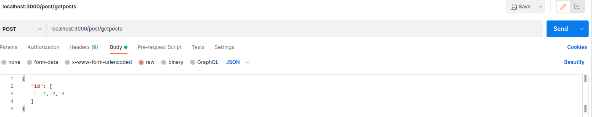
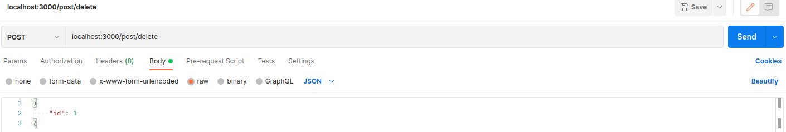
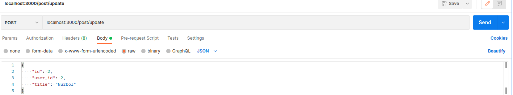

# Simple-Go-Microservices

## Requirements

- Docker
- Docker-compose

## Usage

- Run the `make dockerup` for deployment on local machine and test the endpoints
- Run `make dockerstart` for starting stopped project.
- Run `make dockerstop` for stopping active project.
- Run `make dockerdown` for deleting containers, volumes and images of project. 

## Testing endpoints
API-Gateway available on localhost:3000.

|Service|Method|Endpoint|
|-------|------|--------|
|Parse posts|`POST`|`/parser/parse`|
|Parsing status|`GET`|`/parser/status`|
|Get post|`GET`|`/post/{id}`|
|Get posts|`POST`|`/post/getposts`|
|Delete post|`POST`|`/post/delete`|
|Update post|`POST`|`/post/update`|

### Testing endpoints by Postman

- `localhost:3000/parser/status` - GET request for checking parsing status
- `localhost:3000/parser/parse` - POST request for starting parser
- `localhost:3000/post/1` - GET request for single post
- `localhost:3000/post/getposts` - POST request with JSON `id` array for several posts

- `localhost:3000/post/delete` - POST request with JSON `id` for deleting single post

- `localhost:3000/post/update` - POST request with JSON `id, user_id, title, body` for updating single post

## To-do
- [ ] Optimizing deployment